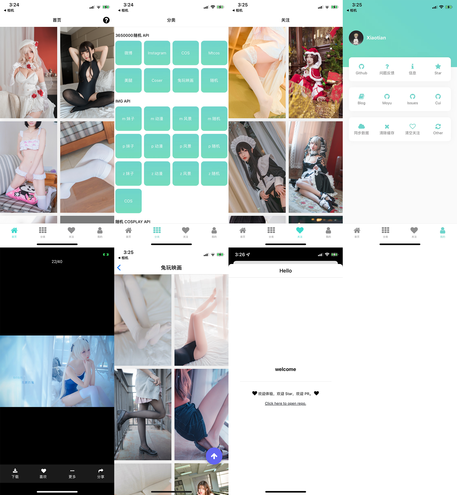

<h1 align="center"> Look </h1>  

  

  Built with React Native.

 

  
  
Expo

<!-- START doctoc generated TOC please keep comment here to allow auto update -->
<!-- DON'T EDIT THIS SECTION, INSTEAD RE-RUN doctoc TO UPDATE -->
## Table of Contents

- [Table of Contents](#table-of-contents)
- [Introduction](#introduction)
- [Features](#features)
- [Feedback](#feedback)
- [Contributors](#contributors)
- [Build Process](#build-process)

<!-- END doctoc generated TOC please keep comment here to allow auto update -->

## Introduction

也许用来看"壁纸"？

> 第一次写 APP 有空就会更新更新 [总结](https://github.com/xiaotiandada/blog/issues/86)

**Available for both iOS (Android Maybe).**

## Features

* 查看感兴趣的壁纸
* 收藏感兴趣的壁纸
* 下载感兴趣的壁纸
* ...

  

## Feedback

[Issues](https://github.com/xiaotiandada/look/issues)

## Contributors

...

## Build Process

- Follow the [React Native Guide](https://facebook.github.io/react-native/docs/getting-started.html) for getting started building a project with native code. **A Mac is required if you wish to develop for iOS.**
- Clone or download the repo
- `yarn`
- `yarn start`
